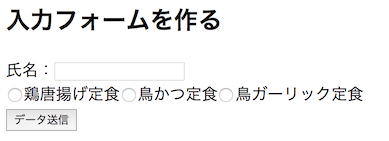

## 3. 入力フォームを増やす

### 手順

FormPage.htmlの `<input type='text'...` の下に、コードを追加する。

```html
<div wicket:id="lunch"></div>
```

FormPage.java のフィールドに変数を追加する。

```java
// lunche の値を格納するModel
private IModel<String> lunchModel;
```

FormPage.java のコンストラクタに以下のコードを追加する。

lunchModel 変数の初期化はnameModelの初期化の直後に追加。

```java
lunchModel = Model.of("");
```

TextField コンポーネントの下に追加。

```java
// ラジオボタンの選択肢を準備
List<String> lunches = Arrays.asList("鶏唐揚げ定食", "鳥かつ定食", "鳥ガーリック定食");
// 選択肢である lunches を格納するModel. List オブジェクト用には ListModel を使う
IModel<List<String>> lunchesModel = Model.ofList(lunches);

// lunches から一つを選択する radio ボタン用のコンポーネント
RadioChoice<String> radioChoice = new RadioChoice<>("lunch", lunchModel, lunchesModel);
form.add(radioChoice);
```

FormPage.javaのFormのonSubmit メソッドの内部に、以下のコードを追加する。

```java
System.out.println("launch : " + lunchModel.getObject());
```

### 動作確認

アプリケーションを再起動して、ブラウザで [http://localhost:8080/](http://localhost:8080/)  から FormPage に移動し、動作を確認する。

ラジオボタンが増え、フォームから送信した入力フォームとラジオボタンの文字列がそれぞれコンソールに選択表示されればOK。




↓入力し、データ送信ボタンをクリック


----

[ハンズオン4へ](./HandsOn04.md)
