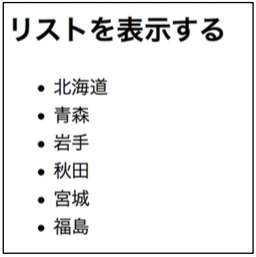

## 5. いろいろなコンポーネント（ListView）

### 手順1

`org.wicket_sapporo.handson.basic.listView` パッケージに以下の2つのファイルを作る。

ListViewPage.html

```html
<!DOCTYPE html>
<html xmlns:wicket="http://wicket.apache.org">
<head>
  <meta charset="UTF-8">
  <title>ListViewPage</title>
</head>
<body>
<h2>リストを表示する</h2>
<ul>
  <li wicket:id="prefectures"><span wicket:id="prefecture"></span></li>
</ul>
</body>
</html>
```

ListViewPage.java

```java
package org.wicket_sapporo.handson.listView;

import org.apache.wicket.markup.html.WebPage;
import org.apache.wicket.markup.html.basic.Label;
import org.apache.wicket.markup.html.list.ListItem;
import org.apache.wicket.markup.html.list.ListView;
import org.apache.wicket.model.IModel;
import org.apache.wicket.model.Model;

import java.util.Arrays;
import java.util.List;

/**
 * リストのデータを一覧で表示するページの例.
 */
public class ListViewPage extends WebPage {
	private static final long serialVersionUID = 1L;

	/**
	 * コンストラクタ.
	 */
	public ListViewPage() {
		// 一覧で表示したいデータをListで用意する
		List<String> prefectures = Arrays.asList("北海道", "青森", "岩手", "秋田", "宮城", "福島");

		// リスト用のモデルは、ListModelを使う。
		// ListModelは、Model.ofList(List) や、new ListModel(List) でインスタンス化できる。
		IModel<List<String>> prefecturesModel = Model.ofList(prefectures);

		// Listを一覧で表示する ListView コンポーネントを生成する
		ListView<String> prefecturesView = new ListView<String>("prefectures", prefecturesModel) {
			private static final long serialVersionUID = 1L;

			@Override
			protected void populateItem(ListItem<String> item) {
				// populateItemメソッドには、Listの要素一つ一つに実行する命令を記載する.
				// Listや配列の要素を処理するfor文みたいな役割をしている。

				// ひとつひとつの要素からModelを取り出して、Labelに利用する
				Label prefectureLabel = new Label("prefecture", item.getModel());
				// ListViewの子要素としてコンポーネントを追加するときは、itemを親と考えてaddメソッドを使うことに注意.
				item.add(prefectureLabel);
			}
		};
		add(prefecturesView);

	}

}
```

### 手順2

**練習： [ハンズオン2](HandsOn02.md)の内容を思い出し、HomePage.htmlとHomePage.java を修正して、ListViewPage に移動できるようにしなさい。**

### 動作確認

ブラウザで http://localhost:8080/wicket_handson/ から ListViewPage に移動し、動作を確認する。
􏰘􏰙􏰒􏰏􏰚􏰎􏰛􏰁􏰑􏰜􏰝􏰉􏰊􏰞􏰟􏰈􏰐􏰌􏰓􏰠􏰠􏰄􏰍􏰡􏰀アプリケーションを再起動して、ブラウザで [http://localhost:8080/](http://localhost:8080/)  からFormPageに移動し、動作を確認する。
入力フォームから送信すると画面遷移し、送信した値が表示されればOK。



----

[ハンズオン6へ](./HandsOn06.md)